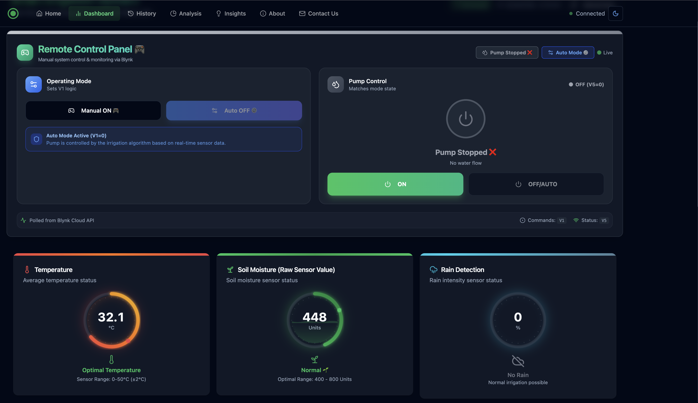
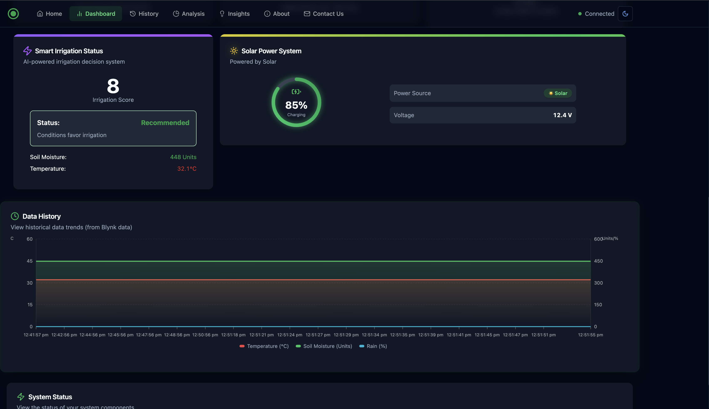

# 🌱 Smart Irrigation System (Blynk Cloud Powered)

A modern, serverless **Smart Irrigation System** built with **ESP8266**, **Blynk IoT Cloud**, and a futuristic **React.js Dashboard**. Designed to autonomously monitor **soil moisture**, **temperature**, and **rain detection** to control a water pump, ensuring efficient water usage and real-time remote management.

---

## 📸 Dashboard Showcase





---

## 🏛 Architecture (Serverless V2)

We recently migrated this project to a serverless architecture for incredible speed, 100% uptime, and zero-maintenance backend hosting! Gone are the days of manually hosting Node.js servers.

```text
[ ESP8266 + Sensors ]  --WiFi/REST-->  [ Blynk IoT Cloud ] 
                                                |
                                                ↓
                                      [ React Web Dashboard (Vercel) ]
```

---

## ⚙️ Features
- 📶 **Serverless Data Streaming**: No Node.js backend required! Direct ESP8266 to Blynk Cloud REST polling.
- 🌡️ **Live Environmental Monitoring**: Tracks Temperature, Soil Moisture (Raw Analog), and Rain Intensity.
- 💧 **AI-Powered Irrigation Logic**: Automatically calculates an "Irrigation Score" using multi-sensor conditions.
- 🌦️ **Rain-Aware**: Automatically halts irrigation cycles if precipitation is detected.
- 🎮 **Manual Remote Override**: Fully control the physical pump remotely via the glowing web dashboard.
- 📊 **Historical Vitals**: Plots real-time data onto beautiful area charts using Recharts.

---

## 🧩 Technology Stack

| Component         | Technology |
|-------------------|-------------------------|
| **Microcontroller**   | ESP8266 (NodeMCU)        |
| **Sensors**           | DHT11/LM35, Analog Soil Moisture, Digital Rain Sensor |
| **IoT Platform**      | Blynk Cloud (REST APIs & Virtual Pins) |
| **Frontend**          | React.js, Vite, TailwindCSS, Framer Motion, Shadcn UI |
| **Hosting**           | Vercel |

---

## 🚀 Quick Setup Instructions

### 📡 1. ESP8266 Firmware (Hardware)
1. Open Arduino IDE and install the `BlynkSimpleEsp8266`.
2. Navigate to `iot/ESP8266/ESP8266.ino`.
3. Enter your WiFi credentials and your **Blynk Auth Token**.
4. Flash the NodeMCU!

### 🌐 2. Client Dashboard (Software)
```bash
cd client
npm install
npm run dev
```

---

## 🛠️ Pin Connections (Virtual & Physical)

### ☁️ Blynk Virtual Pins
| Pin | Data Stream | Data Type |
|---|---|---|
| `V0` | Soil Moisture | Raw Analog (0-1023) |
| `V6` | Temperature | Float / Integer |
| `V5` | Pump Status | String ("ON" / "OFF") |
| `V7` | Rain Status | String ("Rain" / "Clear") |
| `V1` | Remote Command | Boolean (0 = Auto/OFF, 1 = Manual ON) |

### 🔌 Physical ESP8266 Pins
| ESP8266 Pin | Connected To |
|-------------|---------------------------------|
| `A0` (Analog) | Soil Moisture Sensor |
| `D2` (GPIO4)  | LM35 / DHT11 Data Pin |
| `D1` (GPIO5)  | Rain Sensor Output (Digital)    |
| `D5` (GPIO14) | Relay Module / Pump |

---

## ⚡ Troubleshooting
| Problem | Solution |
|---|---|
| **Vercel Deployment throwing 404** | We have included a `vercel.json` rewrites file. Just ensure Vercel's "Root Directory" setting is configured to `client/` inside the Vercel project Settings. |
| **Pump not switching ON/OFF** | Verify that `V1` is correctly sending a `1` or `0` via the Remote Control panel in the dashboard. |


