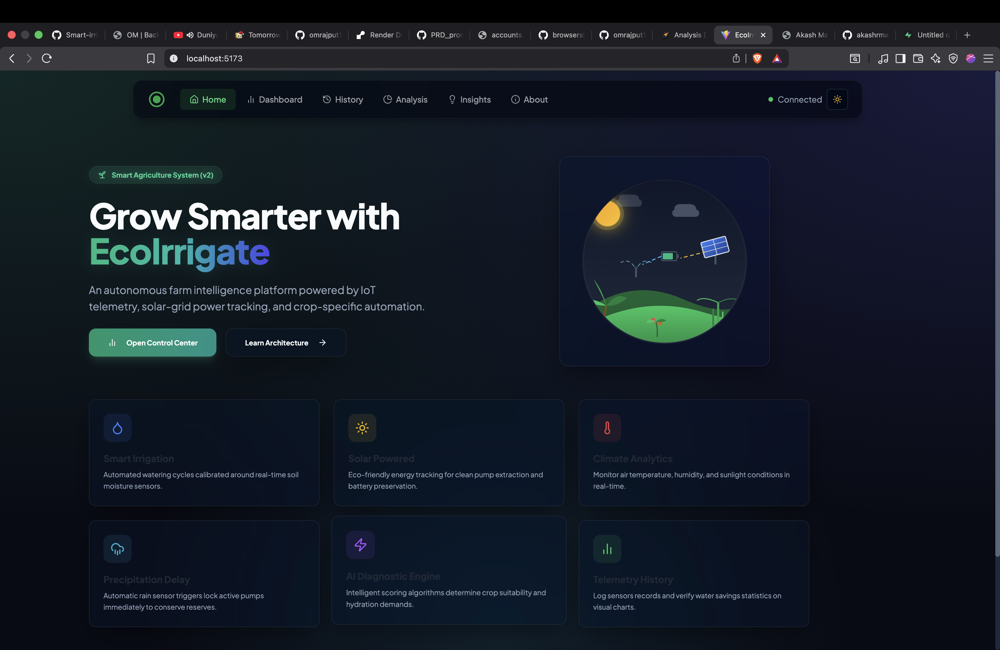
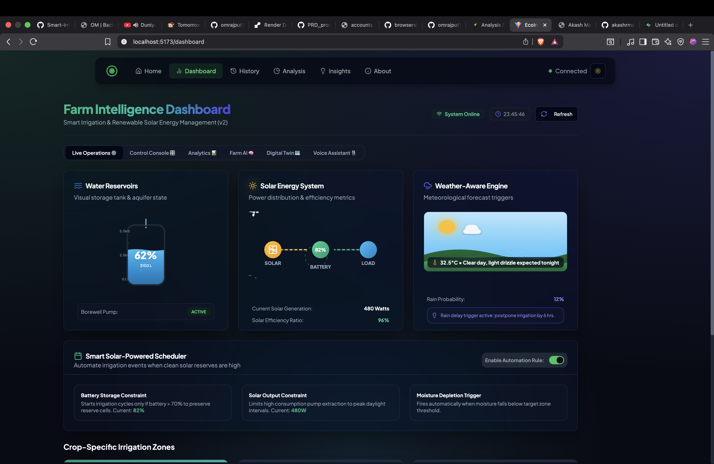
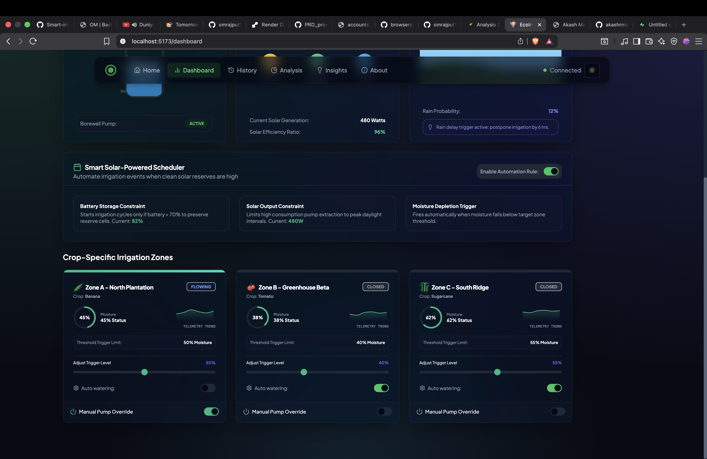
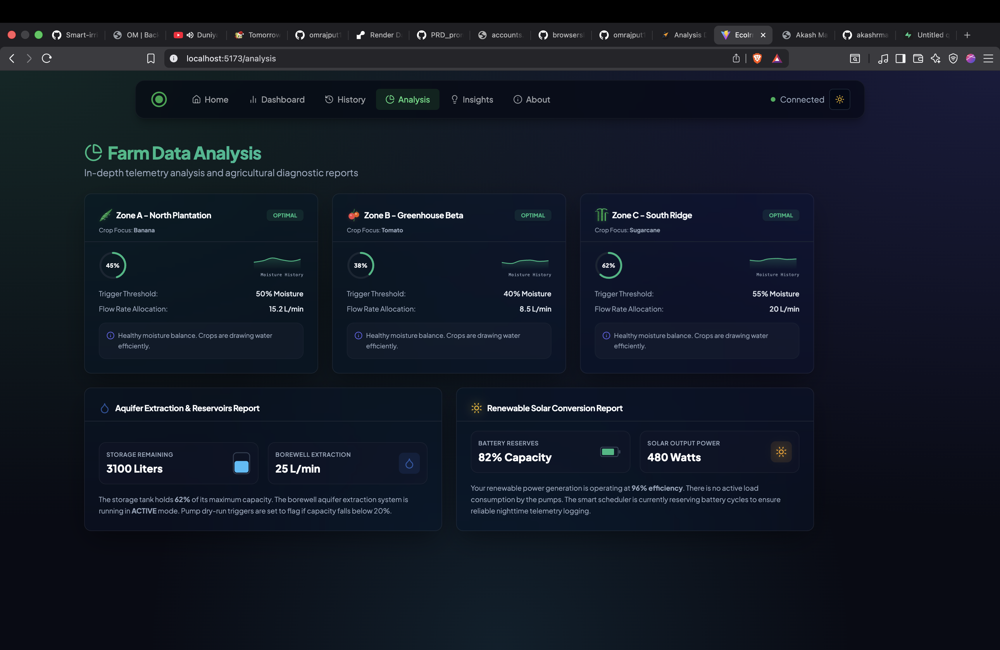
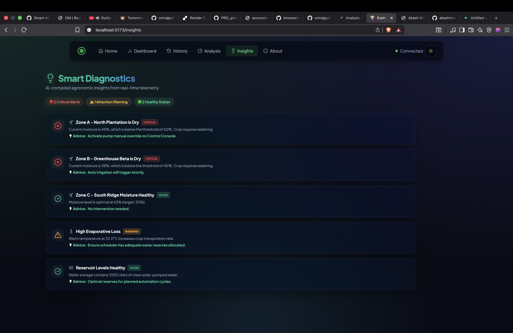
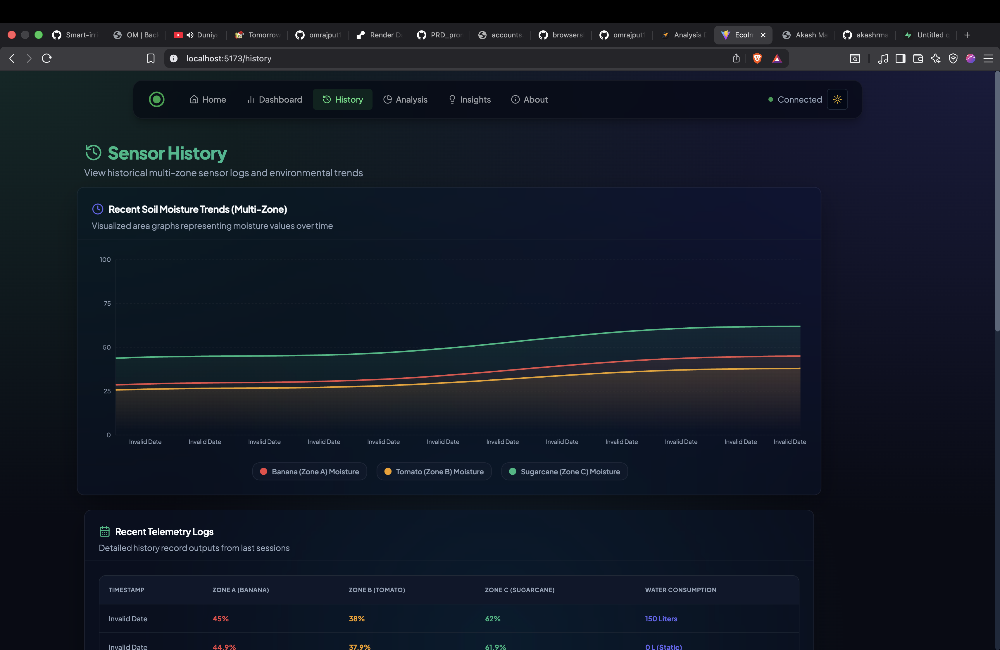
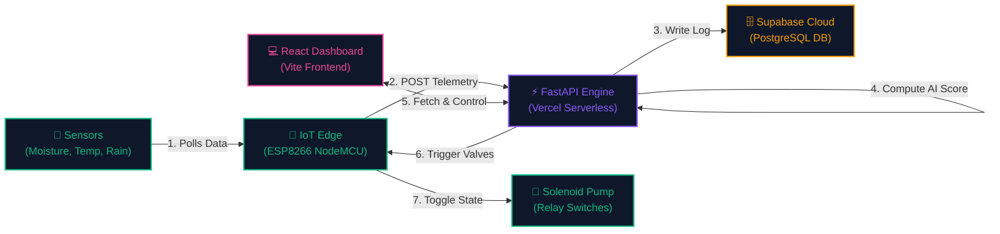

# 🌱 EcoIrrigate: Smart Irrigation & Farm Intelligence Platform (v2)

### 🔗 Live Demo: [ecoirrigate.vercel.app](https://ecoirrigate.vercel.app)

EcoIrrigate is a premium, cloud-integrated **Smart Irrigation & Farm Intelligence System** that combines physical microcontrollers, real-time telemetry pipelines, and predictive AI heuristics. It features an immersive **2.5D isometric farm digital twin blueprint** to monitor soil moisture, manage renewable solar grids, track water reservoir consumption, and dynamically automate field irrigation.

[](https://react.dev)
[](https://fastapi.tiangolo.com)
[](https://supabase.com)
[](https://vercel.com)
[](https://www.espressif.com)

---

## 📸 Interactive System Showcase

### 🏡 1. Sleek Dashboard Landing
A clean split-screen hero design separates copy from interactive smart agricultural controls, showcasing sun, clouds, solar relays, battery charge indicators, and pipeline structures.


### 💧 2. Live Operations Panel
Skeuomorphic aquifer storage gauges fill and deplete dynamically, tracking a real-time water budget alongside solar panel output charging vectors and live meteorological sensors.


### 🌾 3. Crop-Specific Zone Controllers
Interactive control tiles for individual zones (Banana, Tomato, Sugarcane) equipped with moisture gauges, sparkline trends, auto-watering rules, and physical solenoid manual overrides.


### 📊 4. In-depth Data Analytics
Circular gauges with telemetry logs display sensor allocations, flow rates (L/min), battery reserves (%), and water savings metrics dynamically pulled from the cloud database.


### 🧠 5. AI Diagnostics & Warnings
Calculates evaporative loss thresholds based on heat index (DHT11/LM35), triggering warnings, telemetry flags, and crop hydration advice.


### 📈 6. Multi-Zone Historical Trends
Interactive multi-line area charts (powered by Recharts) visualize soil moisture trends, water consumption volumes, and solar efficiency.


## 🏛️ System Architecture & Data Pipeline

EcoIrrigate utilizes a high-efficiency bidirectional data loop. Edge sensors feed telemetry packet streams into the FastAPI serverless API, updating the live Supabase PostgreSQL database while dynamically adjusting pump actuators.



### ⚙️ How It Works
1. **Sense**: ESP microcontrollers poll capacitive moisture, temperature, and rain sensors every 3 seconds.
2. **Analyze**: The backend API processes raw readings, computing an **Irrigation Score** based on soil levels, solar efficiency, and rain probability.
3. **Irrigate**: Physical pump relays fire automatically when thresholds are crossed, or via direct override toggles on the React dashboard.

---

## 🔌 Pin Connections & Hardware Spec

### ☁️ Blynk Virtual Pin Mapping
| Virtual Pin | Data Stream | Data Type | Purpose |
|---|---|---|---|
| `V0` | Soil Moisture | Raw Analog (0-1023) | Moisture percentage conversion |
| `V1` | Remote Command | Boolean (0 = Auto/OFF, 1 = Manual ON) | Toggles pump relay override state |
| `V5` | Pump Status | String ("ON" / "OFF") | Reflects state of physical solenoid |
| `V6` | Temperature | Float / Integer | Ambient air temperature reading |
| `V7` | Rain Status | String ("Rain" / "Clear") | Weather status trigger |

### 🔌 Physical ESP8266 NodeMCU Wiring
| Pin | Interface Type | Connected Sensor / Actuator |
|---|---|---|
| **A0** | Analog | Soil Moisture Probe |
| **D1 (GPIO5)** | Digital Input | Rain Sensor Module |
| **D2 (GPIO4)** | Digital (One-Wire) | DHT11 / LM35 Temperature & Humidity Sensor |
| **D5 (GPIO14)** | Digital Output | Relay Module (Borewell Solenoid Pump) |

---

## 🛠️ Technology Stack

| Layer | Component | Description |
|---|---|---|
| **Frontend** | React.js (v19) | Modern UI with Tailwind CSS and Framer Motion transitions |
| | Recharts | Interactive SVG telemetry charts and historical trend logs |
| **Backend** | FastAPI (Python) | High-performance asynchronous API endpoints |
| | Uvicorn | Asynchronous Server Gateway Interface (ASGI) server |
| **Database** | Supabase | Cloud-hosted PostgreSQL instance for telemetry tracking |
| **IoT Cloud** | Blynk IoT | Cloud interface for microcontroller relay triggers |

---

## 🚀 Quick Setup Instructions

### 📡 1. Supabase Database Setup
Execute the DDL schema script in your Supabase SQL editor:
```bash
# Apply tables, foreign keys, and default schema policies
backend/schema.sql
```
Next, seed the initial database telemetry values:
```bash
# Install virtualenv dependencies
cd backend
venv/bin/pip install -r requirements.txt

# Run the seeding script
venv/bin/python seed_supabase.py
```

### 💻 2. Local Dashboard Development
Start the FastAPI backend server:
```bash
cd backend
venv/bin/python -m uvicorn main:app --reload --host 127.0.0.1 --port 8000
```
Start the React frontend development server:
```bash
cd client
npm install
npm run dev
```

### ☁️ 3. Deploying to Vercel (Production)
The repository is pre-configured with a dual-build [vercel.json](file:///Users/0mrajput/Desktop/hoilday projects /Smart-irrigation-system--main/vercel.json) config that deploys the Vite frontend statically and routes `/api/*` requests to your FastAPI backend serverless function.

Just add your cloud database credentials to the **Environment Variables** in your Vercel Project Settings:
* `SUPABASE_URL` = `https://your-project.supabase.co`
* `SUPABASE_KEY` = `your-secret-service-key`
