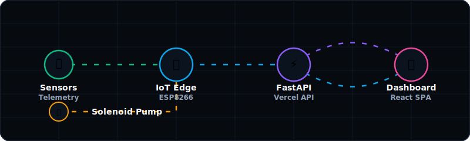

# 🌱 EcoIrrigate: Premium Smart Irrigation & Farm Intelligence Platform (v2)

### 🔗 Live Platform Demo: [ecoirrigate.vercel.app](https://ecoirrigate.vercel.app)

EcoIrrigate is a premium, cloud-integrated **Farm Intelligence & Precision Actuation Platform** that combines physical microcontroller telemetry, real-time cloud database streams, and heuristic predictive algorithms. Featuring a high-fidelity **2.5D digital twin farm twin blueprint**, EcoIrrigate allows farmers to monitor real-time soil dynamics, audit grid solar efficiency, manage aquifer reservoirs, and orchestrate precision agricultural valves.

<p align="center">
  
</p>

<div align="center">

[](https://ecoirrigate.vercel.app)
[](https://react.dev)
[](https://fastapi.tiangolo.com)
[](https://supabase.com)
[](https://blynk.io)

</div>

---

## 📸 Platform Interface Showcase

<div align="center">

### 🏡 1. Sleek Dashboard Landing
A clean split-screen hero layout separating copywriting from active grid telemetry controls, displaying solar relays, battery charge indicators, and pipeline structures.


### 💧 2. Live Operations Panel
Skeuomorphic aquifer storage gauges fill and deplete dynamically, tracking a real-time water budget alongside solar panel output charging vectors and live meteorological sensors.


### 🌾 3. Crop-Specific Zone Controllers
Interactive control tiles for individual zones (Banana, Tomato, Sugarcane) equipped with moisture gauges, sparkline trends, auto-watering rules, and physical solenoid overrides.


### 📊 4. In-depth Data Analytics
Circular gauges with telemetry logs display sensor allocations, flow rates (L/min), battery reserves (%), and water savings metrics dynamically pulled from the cloud database.


### 🧠 5. AI Diagnostics & Warnings
Calculates evaporative loss thresholds based on heat index (DHT11/LM35), triggering warnings, telemetry flags, and crop hydration advice.


### 📈 6. Multi-Zone Historical Trends
Interactive multi-line area charts (powered by Recharts) visualize soil moisture trends, water consumption volumes, and solar efficiency.


</div>

---

## ⚡ Key Architecture Highlights

* 🛰️ **Asynchronous Telemetry Loops**: ESP8266 polls and posts raw sensor data (analog moisture, DHT11 temp/humidity, digital rain) to the cloud database every 2 seconds.
* 🔋 **Solar Grid Auditing**: Tracks battery levels, panels power output (watts), charging states, and solar array health indicators dynamically.
* 💧 **Reservoir Depletion Simulation**: Tracks and computes real-time aquifer storage depletion, borewell refilling flow rates, and water efficiency metrics.
* 🧠 **AgriTech Smart-Water Heuristics**: Automatically predicts moisture depletion curves and restricts physical solenoid valves from opening if precipitation is detected or expected.
* 🎚️ **Remote Precision Controls**: Toggle automated heuristics or force-override pump valves remotely via direct dashboard action buttons backed by Blynk Cloud socket pipelines.

---

## 🔌 Pin Connections & Hardware Spec

<details>
<summary><b>📂 View Microcontroller Pinout & Virtual Stream Configurations</b></summary>

### ☁️ Blynk Virtual Pin Mapping
| Virtual Pin | Data Stream | Data Type | Purpose / Trigger |
| :--- | :--- | :--- | :--- |
| `V0` | Soil Moisture | Raw Analog (0-1023) | Moisture percentage conversion |
| `V1` | Remote Command | Boolean (0/1) | Toggles pump relay override state |
| `V3` | Target Threshold | Integer (0-100) | User-defined target moisture threshold |
| `V4` | System Status | String | Current operation state ("Auto: Watering", "Safe") |
| `V5` | Pump Status | String ("ON"/"OFF") | Reflects state of physical solenoid |
| `V6` | Temperature | Float / Integer | Ambient air temperature reading |
| `V7` | Rain Status | String | Weather status trigger ("Rain" / "Clear") |
| `V8` | Forecast Temp | Float | Retrieved OpenWeather temperature for Dhule |

### 🔌 Physical ESP8266 NodeMCU Wiring
| ESP8266 Pin | Interface Type | Target Sensor / Actuator Pin |
| :--- | :--- | :--- |
| **A0** | Analog | Soil Moisture Probe (Signal Output) |
| **D1 (GPIO5)** | Digital Output | Solenoid Relay Signal Trigger |
| **D4 (GPIO2)** | Digital (One-Wire) | DHT11/LM35 Sensor (Signal Input) |

</details>

---

## 🚀 Environment Setup & Seeding

<details>
<summary><b>🗄️ Supabase Cloud Database Provisioning</b></summary>

Execute the following DDL script inside your Supabase SQL editor:
```sql
-- Apply tables, schemas, and public authorization rules
backend/schema.sql
```
Next, run the Supabase telemetry seeding pipeline:
```bash
# Enter backend directory and configure dependencies
cd backend
venv/bin/pip install -r requirements.txt

# Run the Supabase database seed script
venv/bin/python seed_supabase.py
```
</details>

<details>
<summary><b>💻 Local Dashboard & Microcontroller Setup</b></summary>

Start the FastAPI local server:
```bash
cd backend
venv/bin/python -m uvicorn main:app --reload --host 127.0.0.1 --port 8000
```
Start the Vite React client:
```bash
cd client
npm install
npm run dev
```
Flash the ESP8266 firmware:
* Open `iot/ESP8266/ESP8266.ino` in your Arduino IDE.
* Install dependencies (`Blynk`, `ArduinoJson`, `DHT sensor library`).
* Input your WiFi credentials and your Blynk auth token.
* Click **Upload**.
</details>

<details>
<summary><b>☁️ Production Deployment (Vercel Integration)</b></summary>

The repository features a pre-configured dual-build [vercel.json](file:///Users/0mrajput/Desktop/hoilday projects /Smart-irrigation-system--main/vercel.json) that hosts the React client statically and targets `/api/*` requests to the Python serverless runtime wrapper inside `api/index.py`.

Simply add your database configuration keys under **Environment Variables** in your Vercel Dashboard Settings:
* `SUPABASE_URL` = `https://your-project-url.supabase.co`
* `SUPABASE_KEY` = `your-secret-supabase-key`
</details>
